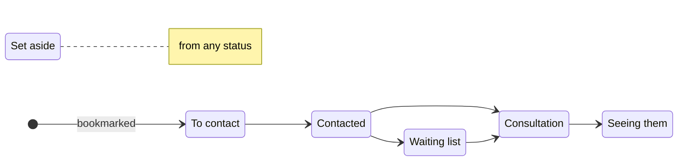

# Therapy search: where each shortlisted therapist stands

Date: 2026-09-30

## 1. Goal and scope

Let a visitor record where they are with each therapist they have shortlisted, from first contact to finding one, so the shortlist follows their search rather than only holding bookmarks. It builds on the shortlist as it stands: kept in this browser, ordered by hand (#63) and mapped on its own tab (#58). The results map's spec is cited as "results-map §n".

In scope:

- Six statuses (§3)
- The shortlist tab grouped by status (§4.1), with therapists dragged within and between groups (§4.2), in compact rows that open in place (§4.3), with a status menu (§4.4)
- Status on result cards (§4.5), and on the profile with a track, a next step and an offer after a contact link (§4.6)
- Status badges on the shortlist's map (§4.7)
- A private note per therapist (§4.8)

Out of scope:

- Dates and follow-up reminders. A status records where the visitor stands with a therapist, not when they got there.
- A board of status columns. It needs the whole window, and fits neither the side bar nor a phone.
- Status badges on the results map's pins. The result cards carry the status (§4.5).
- Structured fields for fees, availability or appointments. The note holds them (§4.8).

## 2. Constraints

- **Kept in this browser alone.** Statuses and notes are stored with the shortlist in `localStorage` and sent nowhere: no Worker route, no analytics.
- **The stored format stays at version 1.** The new fields are optional, so a list saved before them reads as everyone "To contact". A tab still running the previous release drops the fields from every entry when it next changes the shortlist; this lasts only while such a tab stays open across the deploy. A new version number would be worse: the previous release reads an unknown version as an empty list, and its next change saves that over the whole shortlist.
- **Calm.** A status is shown by its label and icon, never by colour alone. Amber stays reserved for the card and pin under the pointer or selected (results-map §4.6).
- **Every change by keyboard.** Dragging works by keyboard (§4.2), and the status menu (§4.4) reaches every status from any row, including one in a closed group.

## 3. Statuses

The usual path, which the profile's track follows (§4.6). The menu and dragging reach every status from every other, so the diagram describes the common case rather than a rule.



| Stored as | Label | Icon (lucide) |
|---|---|---|
| nothing | To contact | `Circle` |
| `contacted` | Contacted | `Send` |
| `waiting` | Waiting list | `Hourglass` |
| `consultation` | Consultation | `CalendarCheck` |
| `seeing` | Seeing them | `CircleCheck` |
| `setAside` | Set aside | `Archive` |

The stored names are fixed here, since renaming one later needs a migration. Each entry gains two optional fields:

```ts
type Status = "contacted" | "waiting" | "consultation" | "seeing" | "setAside";
type ShortlistEntry = { addedAt: number; rank?: number; status?: Status; note?: string; card: ShortlistCard };
```

- Choosing "To contact" clears `status`.
- On reading, an unknown status reads as "To contact", and a note that is not a string as none.
- A therapist removed and added back while the page is open returns with their status and note as well as their place, as the bookmark already returns their place. `add`'s second argument becomes the whole entry less its card.
- Marking a therapist who is not shortlisted (§4.6) adds them with that status.

## 4. Front end

### 4.1 The shortlist tab

- Everyone is grouped by status, in the order of §3's table. Each group has a heading with its icon, label and count, and an empty group is left out except while a row is being dragged (§4.2).
- Within a group, therapists keep the shortlist's own order. The order is global, so a therapist whose status changes by the menu keeps their place relative to everyone else, and the visitor's preference carries from one stage to the next.
- Each heading opens and closes its group. "Set aside" starts closed and the others open, and the choice lasts for the page load.
- The shortlist's map shows the therapists in open groups, so closing a group takes its pins off the map, and the "not on the map" count follows.
- The tab's count leaves out those set aside.
- The empty state adds that each therapist can be marked as the visitor contacts them.

### 4.2 Dragging

- Dragging a therapist reorders them within their group, as it does now, or moves them into another open group, where they take its status. Either way they land between the rows they are dropped between, which sets their place in the global order.
- While a row is being dragged, every group's heading shows, empty ones included, and a therapist dropped on a heading goes to the top of that group. This is how a drag reaches an empty group or a closed one such as "Set aside".
- By keyboard, the arrow keys move a picked-up therapist past headings as well as rows. The announcements name the group as well as the place: "Ruth Okafor moved to Contacted, number 2 of 3."
- A therapist removed from the shortlist, shown faded until the tab is left (§4.3), can't be dragged, as now.

### 4.3 Rows

- A row has the drag handle, a 40 px portrait, the name in the heading face, what the result card shows under the name, a status menu button (§4.4) and a button that opens the row. The name is the row's link to the profile, stretched over it as the card's is.
- An opened row shows the card's summary and the tags matching the search beneath it, then the note (§4.8). Several rows can be open at once.
- A therapist removed from the shortlist stays in place, faded, until the tab is left, as a card does now, with the bookmark in place of the status menu to add them back.

### 4.4 The status menu

- A Radix dropdown menu, added as shadcn's `dropdown-menu` under `src/components/ui/`. Its trigger is an icon button showing the current status's icon and named "Status of Ruth Okafor: contacted".
- It lists the six statuses as radio items with the current one checked, then a separator and "Remove from shortlist".
- Choosing a status moves the row to its group. Focus follows it to the row's menu button there, or to the group's heading while that group is closed, and a polite live region says "Ruth Okafor moved to Contacted." Removing a therapist sends focus to the control that can put them back.

### 4.5 Result cards

- A shortlisted therapist's result card gains their status's label and icon under the place and session types. "To contact" adds nothing, since the filled bookmark says it already.
- A therapist set aside has their card faded, as a removed row is, and the results map no longer picks out their pin as shortlisted. Results keep their order.

### 4.6 The profile

- While the therapist is shortlisted, a track of four steps (To contact, Contacted, Consultation, Seeing them) follows the sticky header, not inside it, so the header keeps its height as the visitor reads on. Steps done are filled. "Waiting list" shows as a paused "Contacted" step with its own label; "Set aside" greys the track and says so.
- Beside the track sit one next-step button and the status menu (§4.4). The button reads "Mark contacted" from "To contact", "Consultation booked" from "Contacted" or "Waiting list", "Seeing them" from "Consultation", and "Consider again", which returns them to "To contact", from "Set aside"; there is none from "Seeing them".
- The track is an ordered list with `aria-current="step"` on the current step.
- Following the phone or email link of a therapist who is "To contact", or not shortlisted, offers "Mark as contacted?" under the contact row, with "Yes" and "Not now". It offers rather than marks because following a link does not mean a message was sent. Website, social and UKCP links do not offer it. The offer stays until it is answered or the profile closes.
- All of this is in `ProfileBody`, so the drawer and the page have it alike.

### 4.7 The shortlist's map

- A single therapist's pin carries their status icon in a small badge at the avatar's bottom left; the remote-only badge keeps the bottom right, and "To contact" has none. The pin's accessible name adds the status: "Ruth Okafor, contacted".
- A stacked pin's avatars overlap too closely for badges, so it carries none and its therapists' rows show their status.
- `pinIcon` takes an optional status per therapist, which only the shortlist's map passes.

### 4.8 Notes

- A plain text area, "Your notes", sits in an opened row (§4.3) and on the profile under the track (§4.6). It saves as the visitor types, half a second after they stop and again when it loses focus, and holds up to 1,000 characters.
- A closed row shows the note's first line, cut to fit, under the card's line.
- Only a shortlisted therapist has a note. Removing them removes it, and adding them back while the page is open returns it (§3).
- The about text's list of what the browser keeps names statuses and notes alongside the shortlist.

## 5. Testing

- **Store:** entries read with and without the new fields; an unknown status and a wrongly typed note; choosing "To contact" clears the status; adding back returns status and note; the note's limit; another tab's changes carry the new fields.
- **Tab:** grouping in order, with empty groups left out; a status change by the menu keeps a therapist's place relative to the rest; "Set aside" starts closed; a closed group's pins leave the map and the unplaced count follows; the tab's count leaves out those set aside; the menu by keyboard, focus after a move and the announcement; removing and adding back.
- **Dragging:** within a group; into another group, taking its status and a place between its new neighbours; every heading showing during a drag; a drop on the heading of an empty or closed group; by keyboard across a heading, with the group named in the announcement.
- **Result cards:** the status line, nothing for "To contact", and the faded card when set aside.
- **Profile:** the track for each status; each next-step button; the contact offer after phone and email but not a website; "Yes" for a therapist not yet shortlisted adds them as "Contacted".
- **Map:** `pinIcon`'s badge and accessible name for each status, and none on a stacked pin.
- **Manual:** a pass in the browser in both themes, on a wide window and in the sheet at phone width: rows, the menu, dragging within and between groups by pointer, touch and keyboard, opening rows, the profile's track and the map's badges.

## 6. Delivery

A stack of pull requests, each on the one before:

1. This spec, the status field, the status menu and the grouped tab (§3, §4.1, §4.4), with the rows still full cards, the menu beside the bookmark, and dragging within a group only.
2. Dragging between groups (§4.2).
3. Compact rows that open in place (§4.3).
4. Status on result cards (§4.5).
5. The profile's track, next step and contact offer (§4.6).
6. Status badges on the shortlist's map (§4.7).
7. Notes (§4.8).
