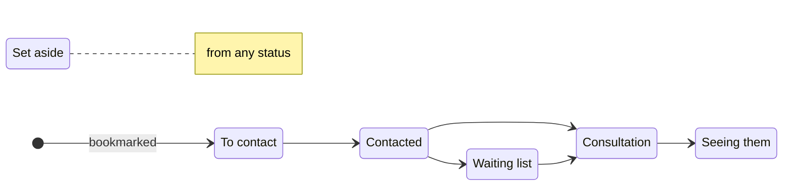

# Therapy search: where each shortlisted therapist stands

Date: 2026-09-30

## 1. Goal and scope

Let a visitor record where they are with each therapist they have shortlisted, from first contact to finding one, so the shortlist follows their search rather than only holding bookmarks. It builds on the shortlist as it stands: kept in this browser, ordered by hand (#63) and mapped on its own tab (#58). The results map's spec is cited as "results-map §n".

In scope:

- Six statuses (§3)
- The shortlist tab as one list in the visitor's order, with those set aside gathered at its foot (§4.1)
- A track on each shortlisted therapist's card showing where the visitor stands, with a next step and a status menu (§4.2, §4.3)
- Status on result cards (§4.4), and on the profile with the same track and an offer after a contact link (§4.5)
- Status badges on the shortlist's map (§4.6)
- A private note per therapist (§4.7)

Out of scope:

- Dates and follow-up reminders. A status records where the visitor stands with a therapist, not when they got there.
- Grouping the shortlist by status, or a board of status columns. The track shows each therapist's status on their card, so the list keeps the visitor's own order; a board would also fit neither the side bar nor a phone.
- Status badges on the results map's pins. The result cards carry the status (§4.4).
- Structured fields for fees, availability or appointments. The note holds them (§4.7).

## 2. Constraints

- **Kept in this browser alone.** Statuses and notes are stored with the shortlist in `localStorage` and sent nowhere: no Worker route, no analytics.
- **The stored format stays at version 1.** The new fields are optional, so a list saved before them reads as everyone "To contact". A tab still running the previous release drops the fields from every entry when it next changes the shortlist; this lasts only while such a tab stays open across the deploy. A new version number would be worse: the previous release reads an unknown version as an empty list, and its next change saves that over the whole shortlist.
- **Calm.** A status is shown by its label and icon, never by colour alone. Amber stays reserved for the card and pin under the pointer or selected (results-map §4.6).
- **Every change by keyboard.** The list reorders by keyboard as it does now, and the status menu (§4.3) reaches every status from any card.

## 3. Statuses

The usual path, which the track follows (§4.2). The menu reaches every status from every other, so the diagram describes the common case rather than a rule.



| Stored as | Label | Icon (lucide) |
|---|---|---|
| nothing | To contact | `Circle` |
| `contacted` | Contacted | `Send` |
| `waiting` | Waiting list | `Hourglass` |
| `consultation` | Consultation | `CalendarCheck` |
| `seeing` | Seeing them | `CircleCheck` |
| `setAside` | Set aside | `Archive` |

The stored names are fixed here, since renaming one later needs a migration. Each entry gains two optional fields:

```ts
type Status = "contacted" | "waiting" | "consultation" | "seeing" | "setAside";
type ShortlistEntry = { addedAt: number; rank?: number; status?: Status; note?: string; card: ShortlistCard };
```

- Choosing "To contact" clears `status`.
- On reading, an unknown status reads as "To contact", and a note that is not a string as none.
- A therapist removed and added back while the page is open returns with their status and note as well as their place, as the bookmark already returns their place. `add`'s second argument becomes the whole entry less its card.
- Marking a therapist who is not shortlisted (§4.5) adds them with that status.

## 4. Front end

### 4.1 The shortlist tab

- The shortlist is one list in its own order, of full cards as now, reordered by dragging their handles (#63). Each card carries the status track (§4.2) under its place and session types, above its summary.
- Those set aside leave the list for a "Set aside" section at its foot, under a heading with its icon, label and count that opens and closes it. It starts closed, and the choice lasts for the page load. Within it they keep the shortlist's order and can be dragged as the list's cards are.
- The order is global, so a therapist set aside and later given another status returns to their old place in the list.
- The shortlist's map shows the list and, while it is open, the "Set aside" section, so closing it takes those pins off the map, and the "not on the map" count follows.
- The tab's count leaves out those set aside.
- The empty state adds that each therapist can be marked as the visitor contacts them.
- A therapist removed from the shortlist stays in place until the tab is left, as now. Only their portrait fades, as a set-aside result's does (§4.4), since the card stays live: the bookmark adds them back as they were (§3). Their track stays, with "Removed from your shortlist" in place of its next-step button and menu.

### 4.2 The status track

- A track of four steps: To contact, Contacted, Consultation, Seeing them. Steps done are filled. "Waiting list" shows as a paused "Contacted" step, and "Set aside" greys the track.
- Under the track sit the current status's label, one next-step button and the status menu (§4.3). The button reads "Mark contacted" from "To contact", "Consultation booked" from "Contacted" or "Waiting list", "Seeing them" from "Consultation", and "Consider again", which returns them to "To contact", from "Set aside"; there is none from "Seeing them".
- The track is an ordered list of the four steps, each named by its label, with `aria-current="step"` on the current one: "Contacted" while on the waiting list, and none while set aside. The steps are not controls.
- One component draws it, on a shortlist card and on the profile (§4.5) alike.

### 4.3 The status menu

- A Radix dropdown menu, added as shadcn's `dropdown-menu` under `src/components/ui/`. Its trigger is an icon button showing the current status's icon and named "Status of Ruth Okafor: contacted".
- It lists the six statuses as radio items with the current one checked, then a separator and "Remove from shortlist".
- A change of status, by the menu or the next-step button, is said in a polite live region: "Ruth Okafor: Contacted." A card that moves into or out of "Set aside" takes focus with it, to its menu button there, or to the section's heading while it is closed. Where the next-step button goes, at "Seeing them", focus moves to the menu beside it. Removing a therapist sends focus to the bookmark, which can put them back.

### 4.4 Result cards

- A shortlisted therapist's result card gains their status's label and icon under the place and session types. "To contact" adds nothing, since the filled bookmark says it already.
- A therapist set aside has their card's portrait faded, its text kept at full contrast since the card stays live in every later search, and the results map no longer picks out their pin as shortlisted. Results keep their order.

### 4.5 The profile

- While the therapist is shortlisted, the status track (§4.2) follows the sticky header, not inside it, so the header keeps its height as the visitor reads on.
- Following the phone or email link of a therapist who is "To contact", or not shortlisted, offers "Mark as contacted?" under the contact row, with "Yes" and "Not now". It offers rather than marks because following a link does not mean a message was sent. Website, social and UKCP links do not offer it. The offer stays until it is answered or the profile closes.
- All of this is in `ProfileBody`, so the drawer and the page have it alike.

### 4.6 The shortlist's map

- A single therapist's pin carries their status icon in a small badge at the avatar's bottom left; the remote-only badge keeps the bottom right, and "To contact" has none. The pin's accessible name adds the status: "Ruth Okafor, contacted".
- A stacked pin's avatars overlap too closely for badges, so it carries none and its therapists' cards show their status.
- `pinIcon` takes an optional status per therapist, which only the shortlist's map passes.

### 4.7 Notes

- A plain text area, "Your notes", sits on the profile under the track (§4.5). It saves as the visitor types, half a second after they stop and again when it loses focus, and holds up to 1,000 characters.
- A shortlist card shows the note's first line, cut to fit, under the track.
- Only a shortlisted therapist has a note. Removing them removes it, and adding them back while the page is open returns it (§3).
- The about text's list of what the browser keeps names statuses and notes alongside the shortlist.

## 5. Testing

- **Store:** entries read with and without the new fields; an unknown status and a wrongly typed note; choosing "To contact" clears the status; adding back returns status and note; the note's limit; another tab's changes carry the new fields.
- **Tab:** one list in the shortlist's order with those set aside at its foot; "Set aside" starts closed, and its pins leave the map while it is; the tab's count leaves out those set aside; dragging within the list and within "Set aside"; a therapist set aside and brought back returns to their old place; focus and the announcement after a change by menu and by next step; removing and adding back.
- **Track:** the steps, label and next-step button for each status, the paused step and the grey track; a removed therapist's track saying so in place of its controls; focus once the next-step button goes.
- **Result cards:** the status line, nothing for "To contact", and the faded portrait when set aside.
- **Profile:** the track after the header; the contact offer after phone and email but not a website; "Yes" for a therapist not yet shortlisted adds them as "Contacted".
- **Map:** `pinIcon`'s badge and accessible name for each status, and none on a stacked pin.
- **Manual:** a pass in the browser in both themes, on a wide window and in the sheet at phone width: the cards' tracks, the menu and next step, dragging by pointer, touch and keyboard, "Set aside" opening and closing, the profile's track and the map's badges.

## 6. Delivery

A stack of pull requests, each on the one before:

1. The status field and the status menu (§3, §4.3), in a shortlist grouped by status until the next (#110).
2. One list with the track on every card, and "Set aside" at its foot (§4.1, §4.2).
3. Status on result cards (§4.4).
4. The profile's track and contact offer (§4.5).
5. Status badges on the shortlist's map (§4.6).
6. Notes (§4.7).
